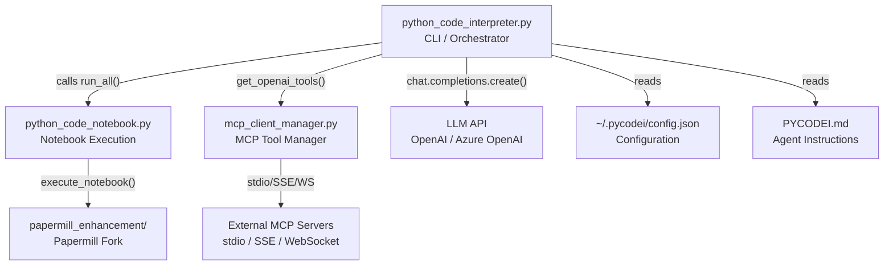
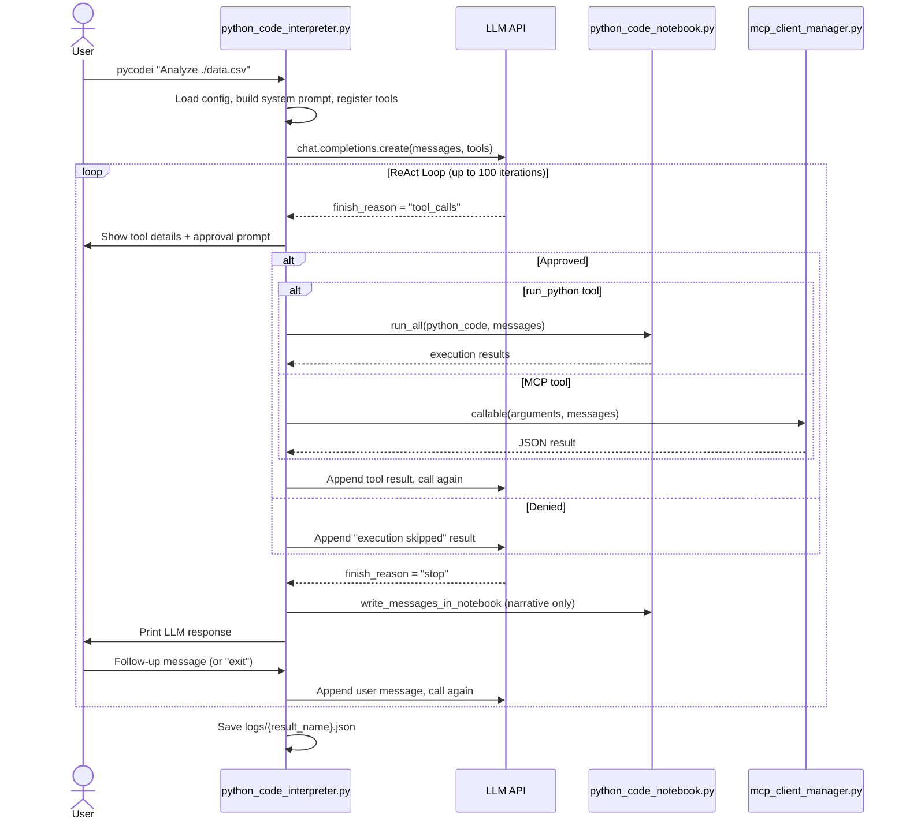
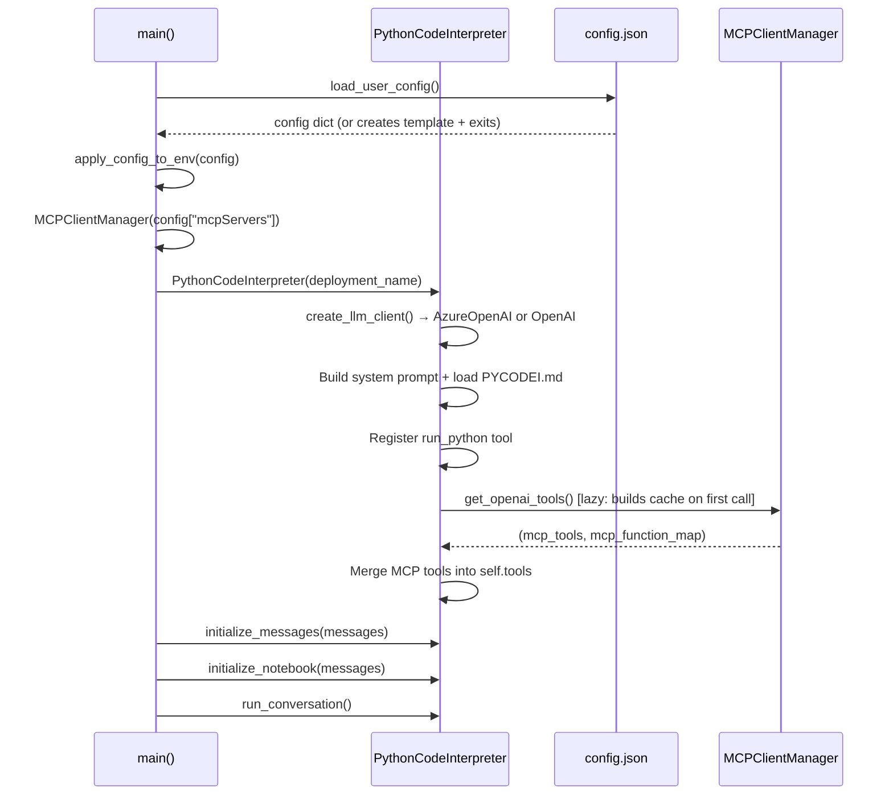
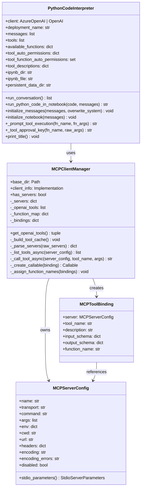
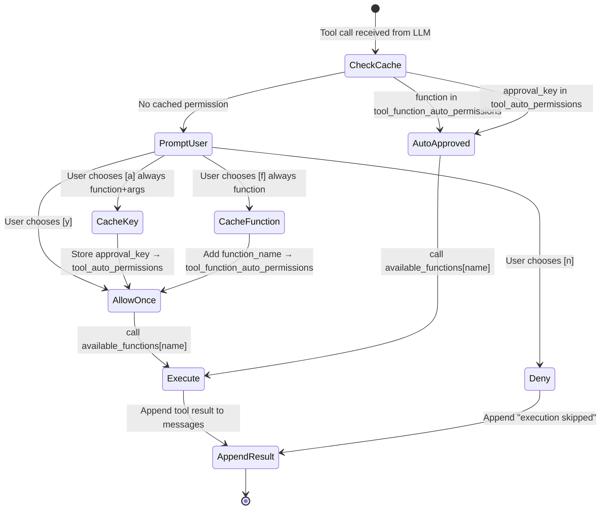
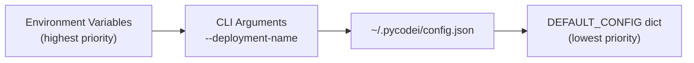

# Architecture

## Overview

PYCODEI is a CLI-based AI agent that uses the **ReAct** (Reasoning + Acting) pattern to perform data analysis, visualization, and computation. The user provides a natural language task; the agent iteratively calls an LLM, executes generated Python code in a persistent Jupyter kernel, and feeds results back to the LLM until the task is complete.

---

## Components

| Module | Lines | Responsibility |
|--------|-------|----------------|
| `python_code_interpreter.py` | 613 | CLI entry point, configuration loading, LLM client creation, ReAct conversation loop, tool approval system |
| `python_code_notebook.py` | 165 | Jupyter notebook creation and code execution via Papermill; result capture |
| `mcp_client_manager.py` | 416 | MCP server discovery, lifecycle management, and tool execution for all transports |
| `set_matplotlib_japanese_font.py` | 53 | One-time helper: configure matplotlib for Japanese character rendering |
| `papermill_enhancement/` | submodule | Fork of [nteract/papermill](https://github.com/nteract/papermill) with enhanced exception handling |

---

## Component Dependencies



---

## ReAct Conversation Loop

The core of PYCODEI is `PythonCodeInterpreter.run_conversation()` (`python_code_interpreter.py:389`). It runs for up to `CONVERSATION_LOOP_MAX_CYCLES` iterations (default: 100).



**Loop exit conditions:**
- User types `exit`
- `finish_flag` is set after a `stop` response and user exits
- `max_loops` iterations reached
- LLM API error

---

## Startup Sequence



---

## Class Structure



---

## Tool Approval System

Every LLM-requested tool call goes through an approval gate before execution (`python_code_interpreter.py:447`). Approvals are cached in-process to avoid repeated prompts.



**Approval key format:** `"{function_name}:{json_args_sorted_keys}"` (`python_code_interpreter.py:272`)

---

## Configuration Layering

Settings are resolved with this priority order (highest to lowest):



The `PYCODEI_CONFIG_DIR` environment variable overrides the default config directory (`~/.pycodei`).

---

## Runtime Artifacts

Running `pycodei` generates these files in the current working directory:

```
./ (current working directory)
├── notebooks/
│   └── {YYYYMMDDHHMMSS}/
│       └── notebook.ipynb          # Live Jupyter notebook updated during session
├── logs/
│   └── log_{YYYYMMDD}-{HHMMSS}.json  # Full API request/response transcript
└── ai_workspace/                   # Persistent data storage for generated code
```

**Notebook structure:** Conversation messages are appended as Markdown cells; Python code executions are appended as Code cells with captured outputs.

**Log file structure:**
```json
{
  "messages": [
    {"role": "system", "content": "..."},
    {"role": "user", "content": "..."},
    {"role": "assistant", "content": "...", "tool_calls": [...]},
    {"role": "tool", "tool_call_id": "...", "name": "...", "content": "..."}
  ],
  "model": "deployment-name",
  "tools": [...]
}
```

Log files can be reloaded with `--load-message` to resume or extend a previous conversation (memory rewind).

---

## Data Structures

### Messages Array (OpenAI Chat Format)

```python
messages = [
    {"role": "system", "content": "<system prompt + PYCODEI.md>"},
    {"role": "user",   "content": "<user prompt>"},
    {
        "role": "assistant",
        "content": None,  # None when tool_calls present
        "tool_calls": [
            {
                "id": "call_abc123",
                "type": "function",
                "function": {"name": "run_python", "arguments": "{\"python_code\": \"...\"}"}
            }
        ]
    },
    {
        "role": "tool",
        "tool_call_id": "call_abc123",
        "name": "run_python",
        "content": "<execution result string>"
    }
]
```

### Tool Definition (OpenAI Function Calling Format)

```python
{
    "type": "function",
    "function": {
        "name": "run_python",
        "description": "...",
        "parameters": {
            "type": "object",
            "properties": {
                "python_code": {"type": "string", "description": "..."}
            },
            "required": ["python_code"]
        }
    }
}
```

### Notebook Execution Result

`python_code_notebook.run_all()` returns a list of per-cell result lists:

```python
[
    # Cell 1 results
    [
        {"text/plain": "42", "output_type": "execute_result"},
        {"text/plain": "<Figure size 640x480>", "output_type": "display_data"},
    ],
    # Cell 2 results
    [
        {"text/plain": "Hello, world!\n", "output_type": "stream"},
    ],
]
```

| `output_type` | Source |
|---------------|--------|
| `execute_result` | Last expression value in a cell |
| `display_data` | `matplotlib` figures, `IPython.display` objects |
| `stream` | `print()` output (stdout only; stderr is silently dropped) |
| `error` | Exception traceback (abbreviated to last frame + exception line if > 3 lines) |
| `pycode_system_error` | Papermill-level exception (not a kernel error) |
