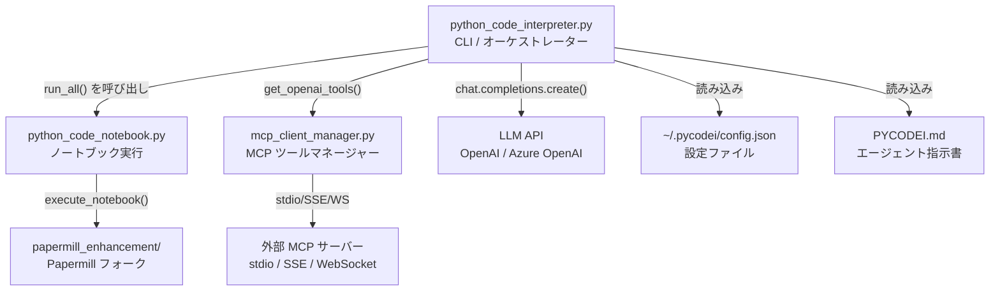
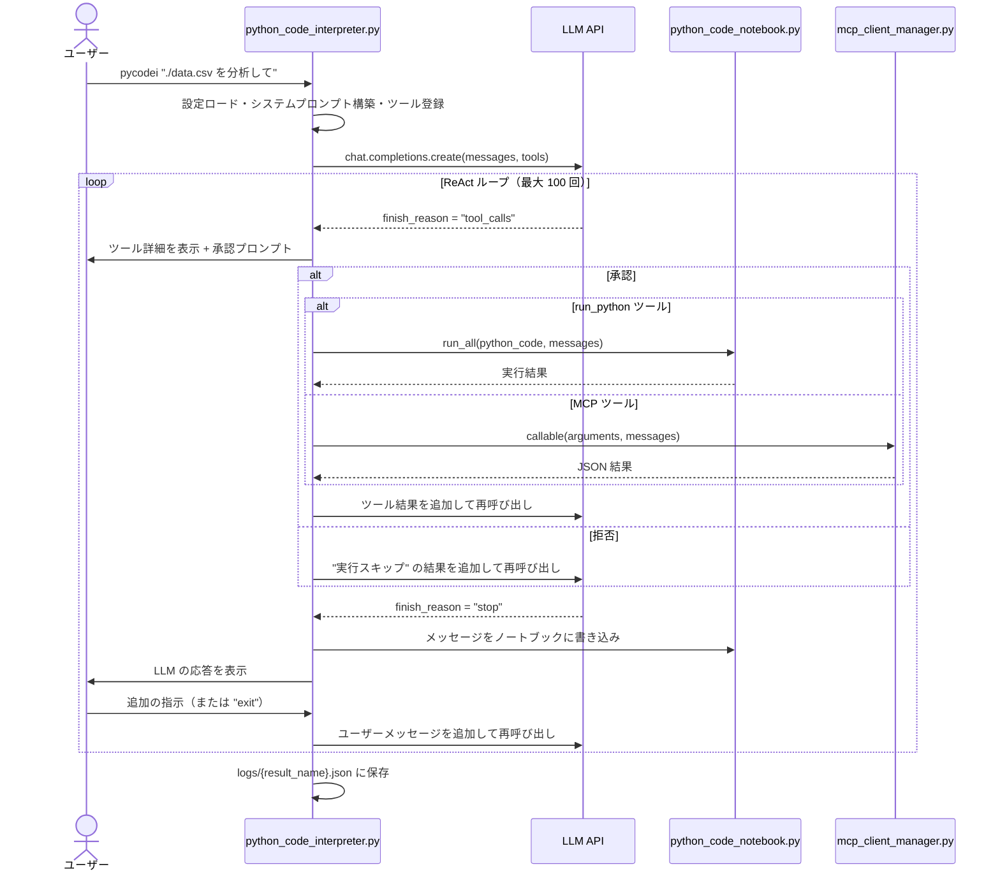
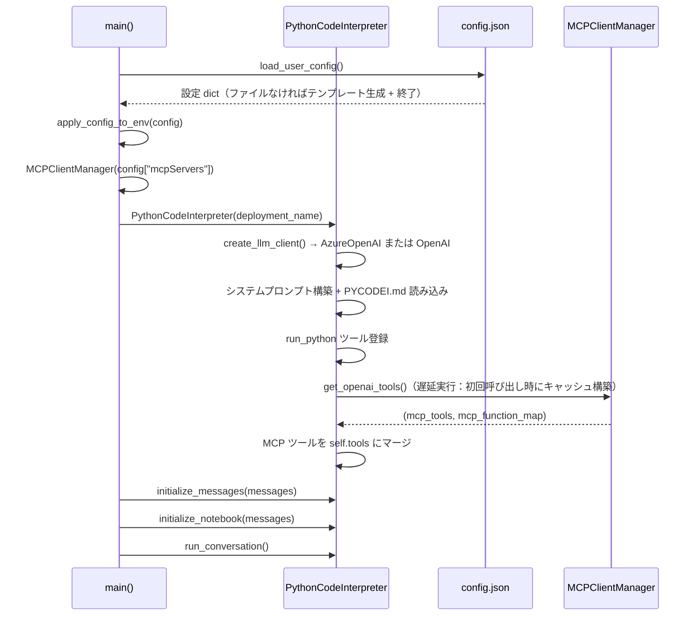
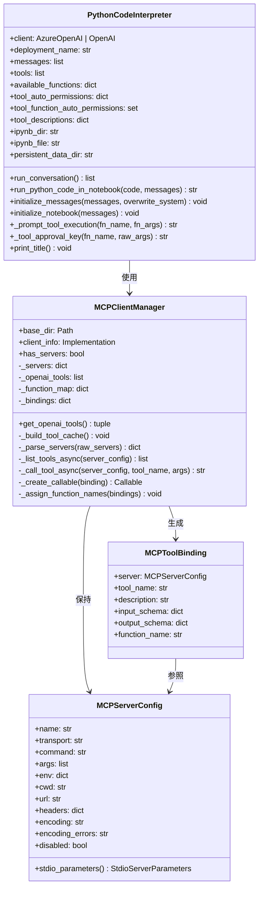
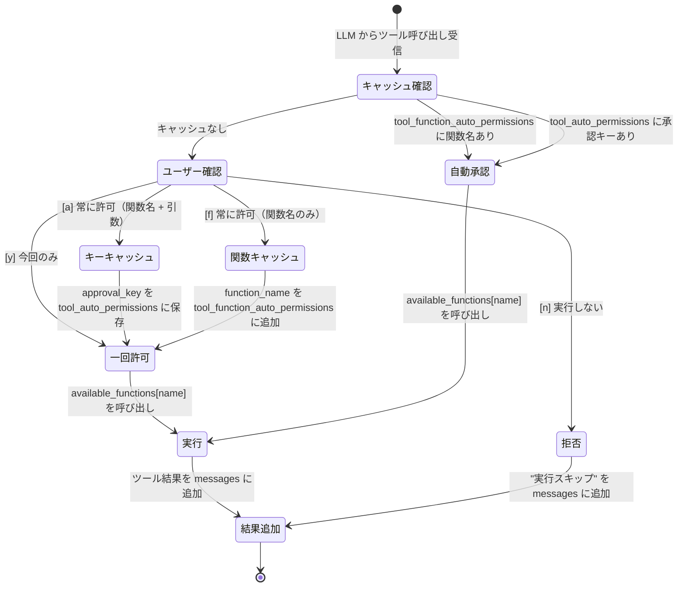
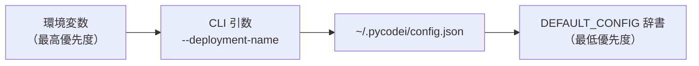

# アーキテクチャ

## 概要

PYCODEI は **ReAct**（推論 + 実行）パターンを用いた CLI ベースの AI エージェントです。ユーザーが自然言語でタスクを入力すると、エージェントは LLM を繰り返し呼び出し、生成された Python コードをステートフルな Jupyter カーネルで実行し、その結果を LLM に返すサイクルを、タスクが完了するまで繰り返します。

---

## コンポーネント一覧

| モジュール | 行数 | 責務 |
|----------|------|-----|
| `python_code_interpreter.py` | 613 | CLI エントリポイント、設定ロード、LLM クライアント生成、ReAct 会話ループ、ツール承認システム |
| `python_code_notebook.py` | 165 | Jupyter ノートブック生成・Papermill によるコード実行・結果キャプチャ |
| `mcp_client_manager.py` | 416 | MCP サーバーの発見・ライフサイクル管理・全トランスポートにおけるツール実行 |
| `set_matplotlib_japanese_font.py` | 53 | matplotlib の日本語フォント設定ヘルパー（一回実行型） |
| `papermill_enhancement/` | サブモジュール | [nteract/papermill](https://github.com/nteract/papermill) のフォーク（例外処理強化版） |

---

## コンポーネント依存関係



---

## ReAct 会話ループ

中核となる `PythonCodeInterpreter.run_conversation()`（`python_code_interpreter.py:389`）は、`CONVERSATION_LOOP_MAX_CYCLES`（デフォルト: 100）回まで繰り返します。



**ループ終了条件:**
- ユーザーが `exit` と入力した
- `stop` 応答後にユーザーが終了した
- `max_loops` に達した
- LLM API エラー

---

## 起動シーケンス



---

## クラス構造



---

## ツール承認システム

LLM からのツール呼び出しリクエストは、実行前に必ず承認ゲートを通過します（`python_code_interpreter.py:447`）。承認はプロセス内でキャッシュされ、同じツール・同じ引数への繰り返しプロンプトを防ぎます。



**承認キーの形式:** `"{function_name}:{json_args_sorted_keys}"` (`python_code_interpreter.py:272`)

---

## 設定の優先順位

設定は以下の優先順位で解決されます（上位が優先）:



`PYCODEI_CONFIG_DIR` 環境変数で設定ディレクトリのデフォルト（`~/.pycodei`）を上書きできます。

---

## 実行時アーティファクト

`pycodei` を実行すると、カレントディレクトリに以下のファイルが生成されます:

```
./ （カレントディレクトリ）
├── notebooks/
│   └── {YYYYMMDDHHMMSS}/
│       └── notebook.ipynb          # セッション中にリアルタイム更新される Jupyter ノートブック
├── logs/
│   └── log_{YYYYMMDD}-{HHMMSS}.json  # LLM との完全なリクエスト/レスポンス記録
└── ai_workspace/                   # 生成コードが使う永続データストレージ
```

**ノートブック構造:** 会話メッセージは Markdown セルとして、Python コード実行はキャプチャされた出力付きの Code セルとして追記されます。

**ログファイル構造:**
```json
{
  "messages": [
    {"role": "system", "content": "..."},
    {"role": "user", "content": "..."},
    {"role": "assistant", "content": "...", "tool_calls": [...]},
    {"role": "tool", "tool_call_id": "...", "name": "...", "content": "..."}
  ],
  "model": "deployment-name",
  "tools": [...]
}
```

ログファイルは `--load-message` で再ロードすることで、過去の会話を再開・継続できます（メモリ巻き戻し機能）。

---

## データ構造リファレンス

### メッセージ配列（OpenAI Chat 形式）

```python
messages = [
    {"role": "system", "content": "<システムプロンプト + PYCODEI.md>"},
    {"role": "user",   "content": "<ユーザーの指示>"},
    {
        "role": "assistant",
        "content": None,  # tool_calls がある場合は None
        "tool_calls": [
            {
                "id": "call_abc123",
                "type": "function",
                "function": {"name": "run_python", "arguments": "{\"python_code\": \"...\"}"}
            }
        ]
    },
    {
        "role": "tool",
        "tool_call_id": "call_abc123",
        "name": "run_python",
        "content": "<実行結果の文字列>"
    }
]
```

### ノートブック実行結果

`python_code_notebook.run_all()` はセルごとの結果リストを返します:

```python
[
    # セル 1 の結果
    [
        {"text/plain": "42", "output_type": "execute_result"},
        {"text/plain": "<Figure size 640x480>", "output_type": "display_data"},
    ],
    # セル 2 の結果
    [
        {"text/plain": "Hello, world!\n", "output_type": "stream"},
    ],
]
```

| `output_type` | 発生元 |
|---------------|-------|
| `execute_result` | セル最後の式の戻り値 |
| `display_data` | `matplotlib` 図・`IPython.display` オブジェクト |
| `stream` | `print()` の出力（stdout のみ。stderr は無視） |
| `error` | 例外のトレースバック（3行超の場合、最終フレーム + 例外行に省略） |
| `pycode_system_error` | Papermill レベルの例外（カーネルエラーではない） |
