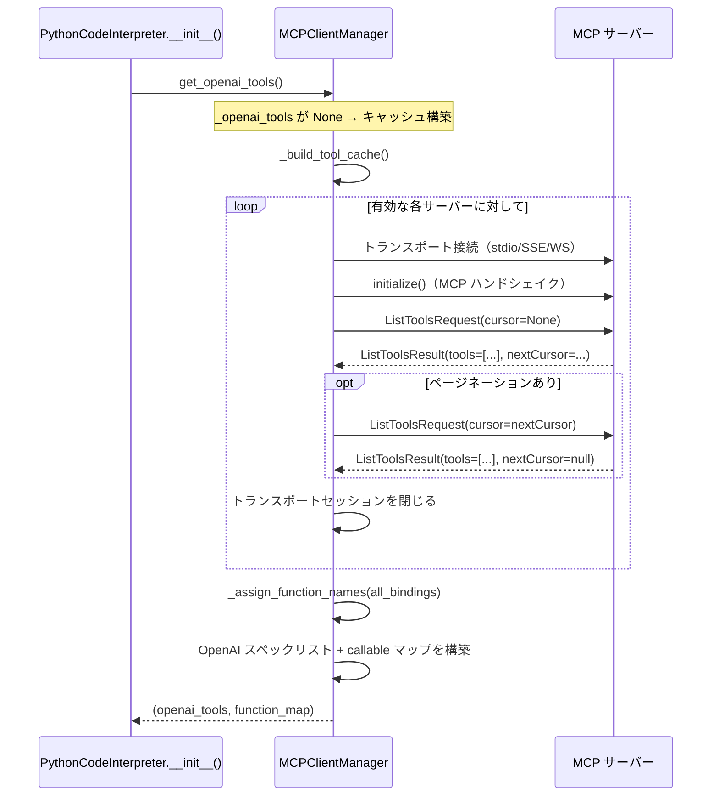
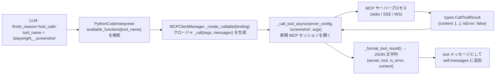

# MCP 統合ガイド

PYCODEI は組み込みの `run_python` ツールに加え、[Model Context Protocol (MCP)](https://modelcontextprotocol.io/) を通じた外部ツールの拡張をサポートしています。本ドキュメントでは MCP サーバーの発見・接続・実行の仕組みと、新規サーバーの追加方法を説明します。

---

## 概要

`MCPClientManager`（`mcp_client_manager.py`）は起動時に生成されるモジュールレベルのシングルトンです。主な役割は以下のとおりです:

1. `config.json` の `mcpServers` を解析する
2. 初回使用時に各有効サーバーに接続してツールを発見する
3. MCP ツールスキーマを OpenAI の function calling 形式に変換する
4. ReAct ループから呼び出せるクロージャを生成する

MCP ツールは LLM からは組み込みの `run_python` ツールと同じように見えます。LLM はツールがローカル実装か外部 MCP サーバーかを区別しません。

---

## サポートするトランスポート

| トランスポート | 設定キー `"transport"` | 必須フィールド | 備考 |
|--------------|----------------------|--------------|------|
| サブプロセス（stdin/stdout） | `"stdio"`（デフォルト） | `command` | 最も一般的。ローカルプロセスを起動。 |
| HTTP Server-Sent Events | `"sse"`、`"http"`、`"https"` | `url` | HTTP 経由のリモートサーバー。 |
| WebSocket | `"websocket"`、`"ws"`、`"wss"` | `url` | WS 経由のリモートサーバー。WebSocket クライアントは遅延インポート。 |

---

## ツール発見フロー



ツール発見は**遅延実行**です: `get_openai_tools()` の初回呼び出し時（`PythonCodeInterpreter.__init__()` 内）に実行され、結果はプロセス終了まで**キャッシュ**されます。

---

## ツール実行フロー



ツール呼び出しごとに**新しいトランスポートセッション**が開かれます。サーバーへの永続接続はありません。これによって隔離性は確保されますが、呼び出しごとにオーバーヘッドが発生します（特に `stdio` サーバーはツール呼び出しごとにサブプロセスが起動します）。

---

## ツール名の生成ルール

MCP ツールは以下の形式で LLM に公開されます:

```
{サーバー名}__{ツール名}
```

`サーバー名` は `config.json` の `mcpServers` のキー、`ツール名` は MCP サーバーが返すツール名です。

**サニタイズルール**（`_sanitize_name()`、`mcp_client_manager.py:266`）:
- 英数字・`_`・`-` 以外の文字は `_` に置換
- 先頭・末尾のアンダースコアを除去
- 64 文字（`MAX_TOOL_NAME_LENGTH`）に切り捨て
- 重複する名前には連番サフィックスを付与: `tool_name_2`、`tool_name_3` など

**例:**
```
サーバー名: "my-playwright"
ツール名:   "browser/screenshot"
→ "my-playwright__browser_screenshot"（スラッシュがアンダースコアに変換）
```

---

## ツール実行結果の形式

MCP ツール呼び出しの結果は LLM に JSON 文字列として返されます:

```json
{
  "server": "playwright",
  "tool": "screenshot",
  "is_error": false,
  "content": [
    {"type": "image", "data": "base64...", "mimeType": "image/png"}
  ],
  "structured_content": { ... }
}
```

`structured_content` は MCP サーバーが構造化出力を返した場合のみ存在します。`is_error: true` はツールレベルのエラーを示し（LLM がリカバリを試みます）、ネットワークエラーやプロセスエラーの場合はこの JSON の代わりにエラー文字列が返ります。

---

## 新規 MCP サーバーの追加手順

### ステップ 1: トランスポートの選択

- **`stdio`**: ローカル CLI ツール（例: `npx @playwright/mcp@latest`）の場合。PYCODEI がプロセスを起動します。
- **`sse`**: 起動済みの HTTP サーバーに接続する場合。
- **`websocket`**: 起動済みの WebSocket サーバーに接続する場合。

### ステップ 2: config.json に追記

**stdio の例:**
```json
{
  "mcpServers": {
    "my-tool": {
      "command": "npx",
      "args": ["-y", "my-mcp-server@latest", "--workspace", "/data"],
      "env": {"MY_API_KEY": "secret"},
      "cwd": "/data"
    }
  }
}
```

**SSE の例:**
```json
{
  "mcpServers": {
    "remote-service": {
      "transport": "sse",
      "url": "https://mcp.example.com/sse",
      "headers": {"Authorization": "Bearer token123"}
    }
  }
}
```

**WebSocket の例:**
```json
{
  "mcpServers": {
    "ws-service": {
      "transport": "websocket",
      "url": "wss://mcp.example.com/ws"
    }
  }
}
```

### ステップ 3: 動作確認

PYCODEI を起動して起動ログを確認します。`pycodei.mcp` ロガーを `DEBUG` レベルに設定するとツール発見の詳細を確認できます:

```bash
PYTHONPATH=. python -c "
import logging
logging.basicConfig(level=logging.DEBUG)
logging.getLogger('pycodei.mcp').setLevel(logging.DEBUG)
from python_code_interpreter import MCP_MANAGER
tools, _ = MCP_MANAGER.get_openai_tools()
for t in tools:
    print(t['function']['name'])
"
```

### ステップ 4: セッションでテスト

```bash
pycodei "利用可能なツールをすべて列挙してください"
```

LLM が利用可能なツール一覧（新しく追加した MCP ツールを含む）を報告します。

---

## 設定を残したまま無効化する

サーバーエントリに `"disabled": true` を設定すると、設定を削除せずにスキップできます:

```json
{
  "mcpServers": {
    "playwright": {
      "disabled": true,
      "command": "npx",
      "args": ["@playwright/mcp@latest"]
    }
  }
}
```

---

## MCPServerConfig フィールドリファレンス

`mcp_client_manager.py:86` の `@dataclass` として定義されています。全フィールドの詳細は [configuration-reference.md](./configuration-reference.md#サーバーごとのフィールド) を参照してください。

**パス展開の動作**（`_expand_path()`、`mcp_client_manager.py:54`）:

- `command` と `cwd` の値がパス形式に見える場合に自動展開
- 「パス形式」の判定: `~`・`.`・`/` で始まる（Unix）、または絶対 Windows パス、またはパス区切り文字を含む
- 相対パスは `~/.pycodei/`（`base_dir`）を基準に解決

---

## よくあるトラブル

| 症状 | 原因の可能性 | 対処法 |
|------|------------|-------|
| セッションでツールが使えない | `disabled: true` または起動エラー | `pycodei.mcp` ロガーを DEBUG レベルで確認 |
| `ValueError: missing command for stdio` | `command` キーが未設定 | サーバー設定に `command` を追加 |
| `ValueError: missing URL for SSE transport` | `url` キーが未設定 | サーバー設定に `url` を追加 |
| `Failed to invoke MCP tool '...'` | サーバープロセスのクラッシュまたはネットワークエラー | サーバーログを確認し、プロセスが動作中か確認 |
| ツール名が予期せず切り捨てられる | 結合名が 64 文字超 | `config.json` のサーバー名キーを短くする |
| ツール名に `_2` サフィックスがつく | 2つのサーバーが同名ツールを公開している | 異なるプレフィックスになるようサーバー名を変更 |
