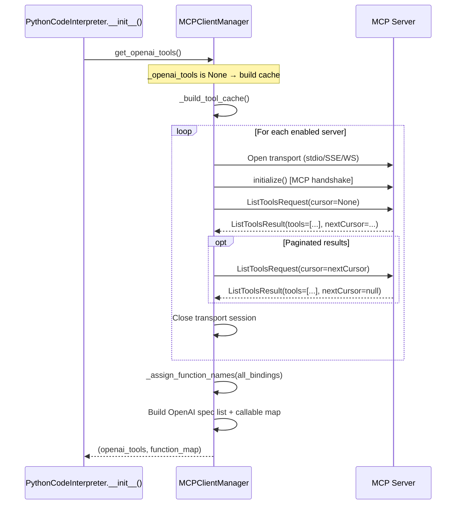
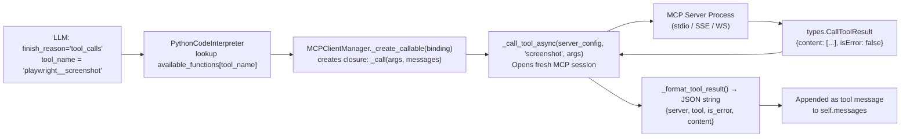

# MCP Integration

PYCODEI extends the built-in `run_python` tool with external tools through the [Model Context Protocol (MCP)](https://modelcontextprotocol.io/). This document explains how MCP servers are discovered, connected to, and invoked, and how to add new servers.

---

## Overview

`MCPClientManager` (`mcp_client_manager.py`) is a module-level singleton instantiated at startup. It:

1. Parses `mcpServers` from `config.json`
2. On first use, connects to each enabled server and discovers its tools
3. Translates MCP tool schemas into OpenAI function-calling format
4. Creates callable wrappers that `PythonCodeInterpreter` can invoke during the ReAct loop

MCP tools appear to the LLM exactly like the built-in `run_python` tool — the LLM does not know whether a tool is implemented locally or by an external MCP server.

---

## Supported Transports

| Transport | Config key `"transport"` | Required field | Notes |
|-----------|-------------------------|----------------|-------|
| Subprocess (stdin/stdout) | `"stdio"` (default) | `command` | Most common. Spawns a local process. |
| HTTP Server-Sent Events | `"sse"`, `"http"`, `"https"` | `url` | Remote server over HTTP. |
| WebSocket | `"websocket"`, `"ws"`, `"wss"` | `url` | Remote server over WS. WebSocket client is lazily imported. |

---

## Tool Discovery Flow



Tool discovery is **lazy**: it runs on the first call to `get_openai_tools()`, which happens in `PythonCodeInterpreter.__init__()`. Results are cached for the lifetime of the process.

---

## Tool Execution Flow



Each tool call opens a **new transport session**. There is no persistent connection to MCP servers between calls. This ensures isolation but adds per-call overhead (especially for `stdio` servers that spawn a subprocess per tool invocation).

---

## Tool Name Generation

MCP tools are exposed to the LLM with names in the format:

```
{server_name}__{tool_name}
```

Where `server_name` is the key in `config.json` under `mcpServers` and `tool_name` is the name returned by the MCP server.

**Sanitization rules** (`_sanitize_name()`, `mcp_client_manager.py:266`):
- Non-alphanumeric characters (except `_` and `-`) are replaced with `_`
- Leading/trailing underscores are stripped
- Truncated to 64 characters (`MAX_TOOL_NAME_LENGTH`)
- Duplicate names get a numeric suffix: `tool_name_2`, `tool_name_3`, etc.

**Example:**
```
server name: "my-playwright"
tool name:   "browser/screenshot"
→ "my-playwright__browser_screenshot"  (slash becomes underscore)
```

---

## Tool Result Format

Every MCP tool call returns a JSON string to the LLM:

```json
{
  "server": "playwright",
  "tool": "screenshot",
  "is_error": false,
  "content": [
    {"type": "image", "data": "base64...", "mimeType": "image/png"}
  ],
  "structured_content": { ... }
}
```

`structured_content` is only present when the MCP server returns structured output. `is_error: true` signals a tool-level error (the LLM can decide how to handle it). Network or process errors return a plain error string instead of this JSON.

---

## Adding a New MCP Server

### Step 1: Choose a transport

- **`stdio`**: Use when the server is a local CLI tool (e.g., `npx @playwright/mcp@latest`). The process is started by PYCODEI.
- **`sse`**: Use when connecting to a running HTTP server.
- **`websocket`**: Use when connecting to a running WebSocket server.

### Step 2: Add to config.json

**stdio example:**
```json
{
  "mcpServers": {
    "my-tool": {
      "command": "npx",
      "args": ["-y", "my-mcp-server@latest", "--workspace", "/data"],
      "env": {"MY_API_KEY": "secret"},
      "cwd": "/data"
    }
  }
}
```

**SSE example:**
```json
{
  "mcpServers": {
    "remote-service": {
      "transport": "sse",
      "url": "https://mcp.example.com/sse",
      "headers": {"Authorization": "Bearer token123"}
    }
  }
}
```

**WebSocket example:**
```json
{
  "mcpServers": {
    "ws-service": {
      "transport": "websocket",
      "url": "wss://mcp.example.com/ws"
    }
  }
}
```

### Step 3: Verify

Start PYCODEI and check startup output. Set `logging.DEBUG` for the `pycodei.mcp` logger to see tool discovery details:

```bash
PYTHONPATH=. python -c "
import logging
logging.basicConfig(level=logging.DEBUG)
logging.getLogger('pycodei.mcp').setLevel(logging.DEBUG)
from python_code_interpreter import MCP_MANAGER
tools, _ = MCP_MANAGER.get_openai_tools()
for t in tools:
    print(t['function']['name'])
"
```

### Step 4: Test in a session

```bash
pycodei "List all available tools"
```

The LLM will report which tools it has access to, including your new MCP tools.

---

## Disabling Without Removing

Set `"disabled": true` on any server entry to skip it without deleting the config:

```json
{
  "mcpServers": {
    "playwright": {
      "disabled": true,
      "command": "npx",
      "args": ["@playwright/mcp@latest"]
    }
  }
}
```

---

## MCPServerConfig Fields Reference

Defined as a `@dataclass` in `mcp_client_manager.py:86`. All fields are documented in [configuration-reference.md](./configuration-reference.md#per-server-fields).

**Path expansion behavior** (`_expand_path()`, `mcp_client_manager.py:54`):

- `command` and `cwd` values that look like paths are expanded
- "Looks like a path" means: starts with `~`, `.`, or `/` (Unix), or is an absolute Windows path, or contains path separators
- Relative paths are resolved against `~/.pycodei/` (the `base_dir`)

---

## MCPToolBinding Internal Structure

Each discovered tool is represented as an `MCPToolBinding` (`mcp_client_manager.py:115`) before being converted to an OpenAI spec:

| Field | Type | Description |
|-------|------|-------------|
| `server` | `MCPServerConfig` | Reference to the owning server config |
| `tool_name` | `str` | Raw tool name from the MCP server |
| `description` | `str \| None` | Tool description from the server |
| `input_schema` | `dict` | JSON Schema for arguments (from `tool.inputSchema`) |
| `output_schema` | `dict \| None` | Optional output schema |
| `function_name` | `str` | Generated OpenAI function name (`server__tool` format) |

---

## Common Issues

| Symptom | Likely Cause | Fix |
|---------|-------------|-----|
| Tool not available in session | Server `disabled: true` or startup error | Check `pycodei.mcp` log at DEBUG level |
| `ValueError: missing command for stdio` | `command` key absent | Add `command` to the server config |
| `ValueError: missing URL for SSE transport` | `url` key absent | Add `url` to the server config |
| `Failed to invoke MCP tool '...'` | Server process crashed or network error | Check server logs; ensure the process is running |
| Tool name truncated unexpectedly | Combined name exceeds 64 chars | Shorten server name key in `config.json` |
| Collision suffix `_2` on tool names | Two servers expose the same tool name | Rename one server key to produce distinct prefixes |
